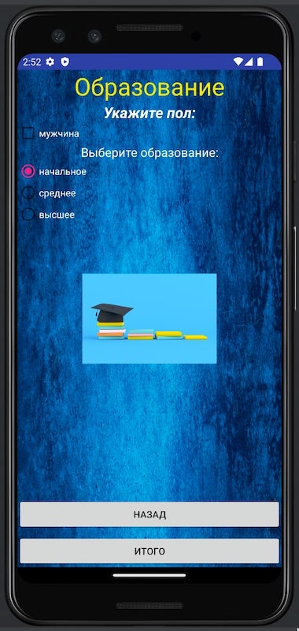
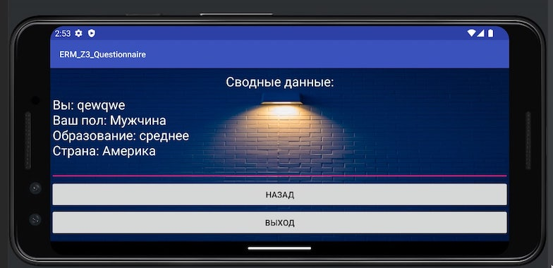

# ERM_ANDROID_Z3
Cделать многооконную программу из 3-х окон с:
1) элементами выбора
2) полями ввода
3) картинками
4) различным фоном
5) кнопками "вперед", "назад", "выход"
   В 3-м окне вывести данные, указанные в предыдущих окнах.
6) 
**Многооконная программа (ERM_Android_Z3):**

