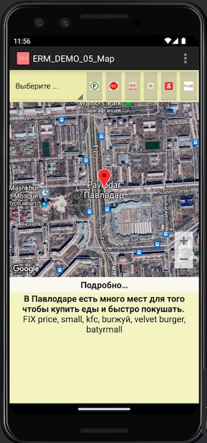

# TSN_DEMO_05_Map
Работа с картами Google

Разработка картографической программы

1) Сделать мини-аналог программы 2GIS для своего района (где проживаете)
   с не менее чем с 6 маркерами с описаниями.
2) Продублировать избранные маркеры кнопками быстрого доступа с табличной разметкой.
3) Сделать выпадающий список для выбора нужного маркера с последующим переходом к нему. Spinner combobox
4) При нажатии на кнопку "Подробно" должна открываться информационная локальная
   web-страница с наличием ссылок на внешние ресурсы (карты, сайты, встраивание YouTube)
5) Сделать в программе основное меню (в правом верхнем углу) с выбором типа карты:
   нормальная, спутник или рельеф

