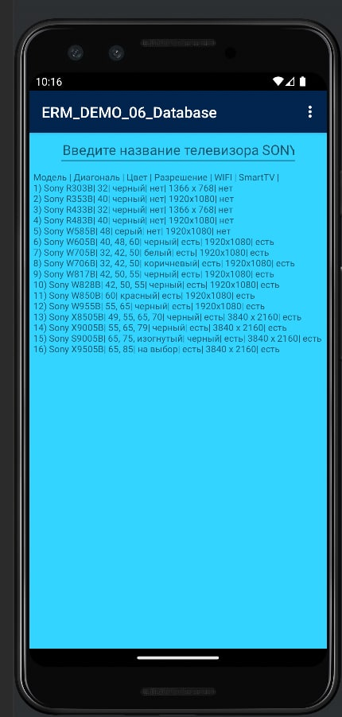
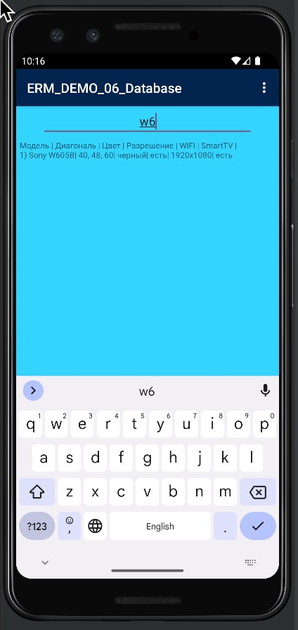

# ERM_DEMO_06_Database
В базе данных должна быть таблица с 6 полями (строковыми, числовыми).

В программе должен быть организован поиск данных по вводимому фильтру с выбором поля для поиска.
Поиск по текстовым полям должен искать по фрагменту вхождения, а по числовым полям вхождение
в диапазон от указанного значения и более.

К работе приложить полученную из Android базу данных SQLite с данными.
7. Телевизоры

